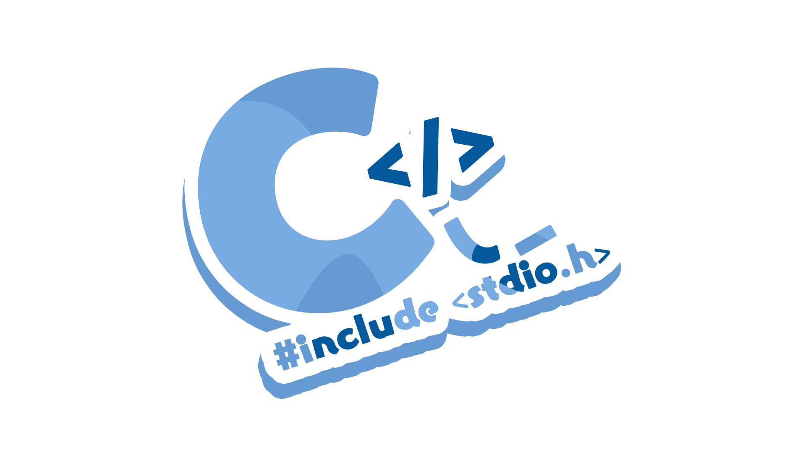

<!-- ## Hi there 👋 -->

<!--
**chocomint-develop/chocomint-develop** is a ✨ _special_ ✨ repository because its `README.md` (this file) appears on your GitHub profile.

Here are some ideas to get you started:

- 🔭 I’m currently working on ...
- 🌱 I’m currently learning ...
- 👯 I’m looking to collaborate on ...
- 🤔 I’m looking for help with ...
- 💬 Ask me about ...
- 📫 How to reach me: ...
- 😄 Pronouns: ...
- ⚡ Fun fact: ...
-->
# 👋 Chào mừng bạn đến với GitHub của mình!

Mình là **Đặng Thành Tân**, một sinh viên ngành Công nghệ thông tin (CNTT) :33
Mình là một cư dân Trà Vinh, sống và hít thở không khí của máy tính, điện thoại thông minh, thiết bị công nghệ, nhạc King Gnu và anime! 

---

### 👨‍💻 Về mình
*   **Chuyên ngành:** Công nghệ thông tin (CNTT)
*   **Sở thích:** Nghe nhạc
*   **Tư duy thẩm mỹ:** Mình hướng tới phong cách "Văn Ming" – sự kết hợp giữa hiệu năng mạnh mẽ bên trong và vẻ ngoài tối giản, chuyên nghiệp.

---

## 🛠 Tech Stack & Công cụ

Dưới đây là những công cụ và ngôn ngữ mình thường xuyên sử dụng:

  <!-- Ngôn ngữ -->
  Về ngôn ngữ:    
  
  
    
  
   
  <!-- Frameworks & Tools -->
   Về Frameworks & Tools:    
  
  
  

---

### 🌐 Kết nối với mình
*   **Các profile của mình ở bên trái
*   **Sở thích đặc biệt:** Nếu bạn muốn bàn luận, âm thanh Hi-Res, Dolby, hoặc các mẹo, đừng ngần ngại kết nối nhé!
